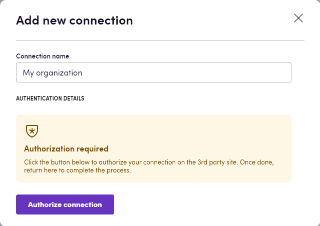
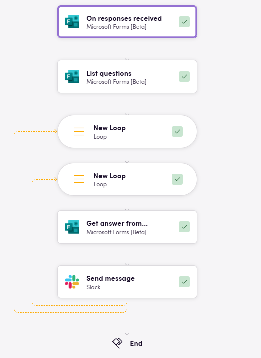

# Blackbird.io Microsoft Forms

Blackbird is the new automation backbone for the language technology industry. Blackbird provides enterprise-scale automation and orchestration with a simple no-code/low-code platform. Blackbird enables ambitious organizations to identify, vet and automate as many processes as possible. Not just localization workflows, but any business and IT process. This repository represents an application that is deployable on Blackbird and usable inside the workflow editor.

## Introduction

<!-- begin docs -->

Microsoft Forms (formerly Office 365 Forms) is an online survey creator, part of Office 365. Released by Microsoft in June 2016, Forms allows users to create surveys and quizzes with automatic marking.

## Before setting up

Before you can connect you need to make sure that you have a Microsoft 365 account.

## Connecting

1. Navigate to apps and search for Microsoft Forms.
2. Click _Add Connection_.
3. Name your connection for future reference e.g. 'My organization'.
4. Click _Authorize connection_.
5. Follow the instructions that Microsoft gives you, authorizing Blackbird.io to act on your behalf. 
6. When you return to Blackbird, confirm that the connection has appeared and the status is _Connected_.

## Actions

- **List my forms** retrieves a list of forms created by me.
- **Get form info** retrieves information about specific form.
- **List questions** retrieves a list of questions of specific form.
- **List responses** retrieves a list of responses of specific form.
- **Get answer from response** get an answer to a specific question of specific response as a string
- **Download responses as excel file** download responses of specific form as an excel file

## Events

- **On responses received** is triggered when new responses are received from specified form.

## Example

Here, when new responses are received, we send an answer to each question of each response to slack.

<!-- end docs -->
